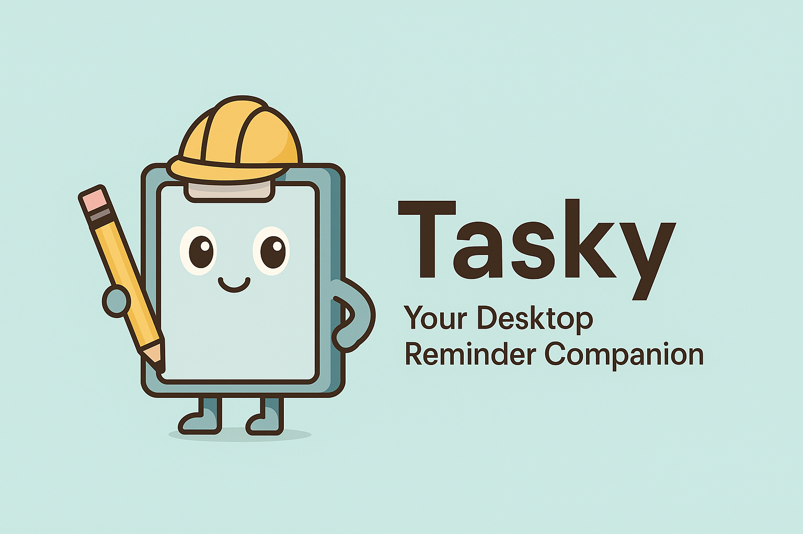

# Tasky 📋



A modern desktop reminder application with an animated assistant companion. Tasky helps you stay organized with customizable recurring reminders, notification sounds, and a friendly desktop companion that delivers your reminders with personality.


## Features ✨

### Core Functionality
- **Recurring Reminders**: Set up reminders for specific days of the week and times
- **System Tray Integration**: Runs quietly in your system tray
- **Cross-Platform**: Works on Windows, macOS, and Linux
- **Notification Sounds**: Customizable audio alerts for reminders
- **Auto-Start**: Optional automatic startup with your system

### Desktop Assistant
- **Animated Companion**: Choose from multiple avatar characters
- **Custom Avatars**: Use your own images as assistant avatars
- **Interactive Speech Bubbles**: Reminders delivered with personality
- **Positioning Options**: Place assistant above or below other windows
- **Draggable Interface**: Move your assistant anywhere on screen

### Customization
- **Multiple Themes**: Light and dark mode support
- **Notification Appearance**: Customize notification colors, fonts, and text colors
- **Flexible Settings**: Configure notifications, sounds, and assistant behavior
- **Bubble Positioning**: Choose left or right side speech bubbles
- **Animation Controls**: Enable or disable assistant animations
- **Font Selection**: Choose from 9 different fonts for notifications with live preview

## Installation 🚀

### Download Pre-built Binary
1. Visit the [Releases](https://github.com/your-repo/tasky/releases) page
2. Download the latest version for your operating system:
   - Windows: `Tasky-Setup-1.0.0.exe`
   - macOS: `Tasky-1.0.0.dmg`
   - Linux: `Tasky-1.0.0.AppImage`

### Build from Source
```bash
# Clone the repository
git clone https://github.com/your-repo/tasky.git
cd tasky

# Install dependencies
npm install

# Run in development mode
npm run dev

# Build for production
npm run build

# Create distributable packages
npm run dist
```

## Usage 📖

### Getting Started
1. Launch Tasky - it will appear in your system tray
2. Right-click the tray icon and select "📋 Open Settings"
3. Create your first reminder by clicking "Add Reminder"
4. Configure your desktop assistant in the Assistant tab

### Creating Reminders
1. Click "Add Reminder" in the main interface
2. Enter your reminder message
3. Set the time (supports both 12-hour and 24-hour formats)
4. Select which days of the week to repeat
5. Enable the reminder with the toggle switch

### Customizing Your Assistant
1. Go to the "Assistant" tab in settings
2. Choose from built-in avatars: Clippy, Merlin, Rover, Genie, Rocky, Bonzi, Peedy, Links
3. Or upload your own custom avatar image
4. Adjust positioning, animation, and speech bubble settings
5. Toggle dragging mode to move your assistant around the desktop

### Customizing Notifications
1. Go to the "Settings" tab
2. Under "Notifications & Alerts":
   - **Notification Color**: Choose background color for popup bubbles
   - **Notification Font**: Select from 9 fonts with live preview
   - **Notification Text Color**: Set text color for optimal readability
3. Test your changes with the "Test Notification" button

### System Tray Features
- **Left-click/Double-click**: Open settings window
- **Right-click**: Access context menu with quick toggles
- **Notifications Toggle**: Quickly enable/disable all reminders
- **Exit**: Properly close the application

## Configuration ⚙️

Tasky stores its configuration in the following locations:
- **Windows**: `%APPDATA%/tasky/tasky-config-v2.json`
- **macOS**: `~/Library/Application Support/tasky/tasky-config-v2.json`
- **Linux**: `~/.config/tasky/tasky-config-v2.json`

### Key Settings
```json
{
  "enableNotifications": true,
  "enableSound": true,
  "enableAssistant": true,
  "autoStart": false,
  "selectedAvatar": "Clippy",
  "enableAnimation": true,
  "assistantLayer": "above",
  "bubbleSide": "left",
  "enableDragging": true,
  "notificationColor": "#7f7f7c",
  "notificationFont": "system",
  "notificationTextColor": "#ffffff"
}
```

## Development 🛠️

### Project Structure
```
tasky/
├── src/
│   ├── main.js              # Main Electron process
│   ├── preload.js           # Preload script for security
│   ├── electron/            # Electron backend modules
│   │   ├── scheduler.js     # Reminder scheduling logic
│   │   ├── storage.js       # Data persistence
│   │   ├── assistant.js     # Desktop companion
│   │   └── assistant-script.js # Assistant frontend logic
│   ├── renderer/            # React frontend
│   │   ├── App.jsx          # Main React component
│   │   └── dist/            # Built frontend assets
│   ├── components/          # React components
│   └── assets/              # Images, sounds, icons
├── package.json
└── README.md
```

### Technologies Used
- **Electron**: Desktop application framework
- **React**: Frontend user interface
- **Vite**: Build tool and development server
- **Tailwind CSS**: Styling framework
- **node-cron**: Reminder scheduling
- **electron-store**: Data persistence

### Available Scripts
```bash
npm run dev          # Start development server
npm run build        # Build renderer and electron
npm run build-renderer # Build React frontend only
npm run build-electron # Build Electron backend only
npm run dist         # Create distributable packages
npm run pack         # Package without creating installer
```

### Building for Distribution
The application uses `electron-builder` for creating distributable packages:

```bash
# Build and package for current platform
npm run dist

# The output will be in the dist/ directory:
# - Windows: .exe installer and unpacked folder
# - macOS: .dmg and .app bundle
# - Linux: .AppImage and .deb packages
```

## Troubleshooting 🔧

### Common Issues

**Notifications not appearing:**
- Check if notifications are enabled in your system settings
- Ensure Tasky has notification permissions
- Try the "Test Notification" button in settings

**Sound not playing:**
- Verify that sound is enabled in Tasky settings
- Check your system volume and audio output
- Make sure the notification.mp3 file is present in the assets folder

**Assistant not showing:**
- Enable the assistant in the Assistant tab
- Check if the assistant layer is set correctly
- Try different avatar options if custom avatar fails to load

**Auto-start not working:**
- Ensure auto-start is enabled in settings
- Check your system's startup programs list
- Run the application as administrator once (Windows)

### Logs and Debugging
Development logs are available in the console when running `npm run dev`. For production builds, logs are minimal to improve performance.

## Contributing 🤝

We welcome contributions to Tasky! Please follow these guidelines:

1. Fork the repository
2. Create a feature branch (`git checkout -b feature/amazing-feature`)
3. Commit your changes (`git commit -m 'Add amazing feature'`)
4. Push to the branch (`git push origin feature/amazing-feature`)
5. Open a Pull Request

### Development Guidelines
- Follow the existing code style and structure
- Add comments for complex functionality
- Test on multiple platforms when possible
- Update documentation for new features

## License 📄

This project is licensed under the MIT License - see the [LICENSE](LICENSE) file for details.

## Acknowledgments 🙏

- Inspired by classic desktop assistants like Microsoft Clippy
- Built with modern web technologies and Electron
- Thanks to the open-source community for the amazing tools and libraries

## Support 💬

If you encounter any issues or have questions:
1. Check the troubleshooting section above
2. Search existing [Issues](https://github.com/your-repo/tasky/issues)
3. Create a new issue with detailed information about your problem

---

**Made with ❤️ by the Tasky Team**

Stay organized, stay productive! 🚀